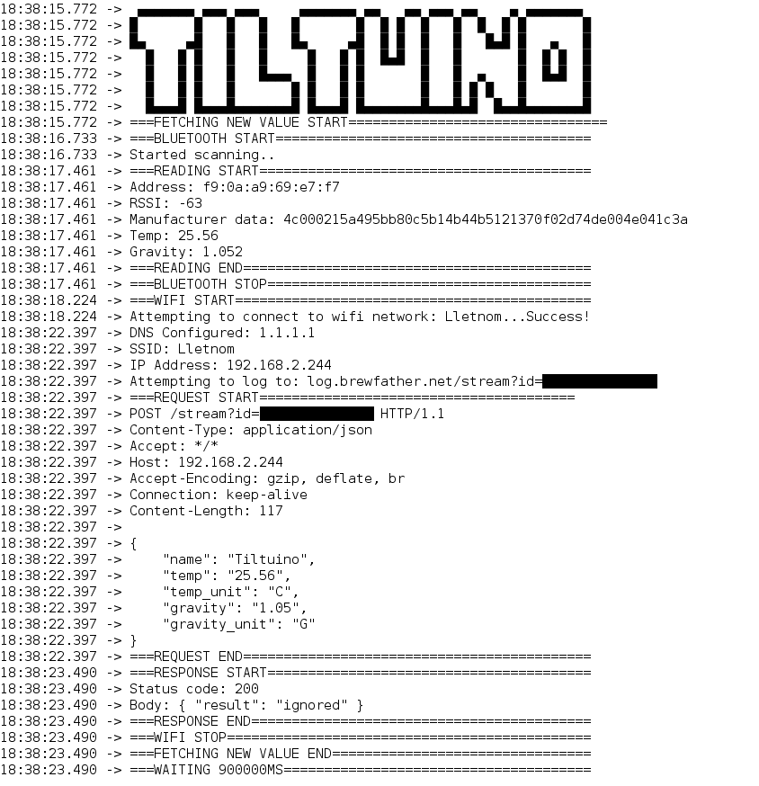

# Tiltuino

Tiltuino is a [Arduino 33 IoT](https://store.arduino.cc/arduino-nano-33-iot) project that allows collecting measurements from the [Tilt Hydrometer V2](https://tilthydrometer.com/) and log it to the [Brewfather](https://brewfather.app/) API.

The project (apart from the Tilt Hydrometer) requires only the Arduino 33 IoT.

## Why?

I pretty much only use my Tilt Hydrometer with Brewfather. And the official way of logging with a Raspberry Pi demands that I either dedicate one device fully or that I always ferment in the same area so my Pi Bluetooth is within reach. On top of that I have to update the device, change the sd-card when it fails and deal with other things implied by running a full linux distribution.

This enables me to address all of those inconveniences with one small and compared to the Raspberry Pi (v3-4B), cheap device.

## How is data read?

The Tilt Hydrometer V2 makes use of ibeacon and communicates through Bluetooth LE. Instead of using the Service and Characteristic method of publishing data to its subscribers, it broadcasts a major and minor value in the manufacturer data. Those two values are extracted and converted into decimal values.

The official [ArduinoBLE library](https://github.com/arduino-libraries/ArduinoBLE) currently does not support reading the devices manufacturer data. I found that a guy had already made the needed changes and put them in a [pull request](https://github.com/arduino-libraries/ArduinoBLE/pull/53), but this pull request has been unhandled for a year. So I decided to fork the library and add the changes myself to make it easy to clone [Wholteza/ArduinoBLE](https://github.com/Wholteza/ArduinoBLE).

With the manufacturer data dumped and with some help from a [post on the arduino forums](https://forum.arduino.cc/index.php?topic=626200.0) I discovered the following.

### Breakdown of the manufacturer data

`4c 00 02 15 a4 95 bb 80 c5 b1 4b 44 b5 12 13 70 f0 2d 74 de 00 4e 04 1c 3a`

| Apple beacon | Type (ibeacon constant) | Length (ibeacon constant) |                                     Device UUID | Major (Temperature in farenheit) | Minor (Specific gravity x 1000) | Unknown (Signal strength?) |
| :----------: | :---------------------: | :-----------------------: | ----------------------------------------------: | :------------------------------: | :-----------------------------: | :------------------------: |
|    4c 00     |           02            |            15             | a4 95 bb 80 c5 b1 4b 44 b5 12 13 70 f0 2d 74 de |              00 4e               |              04 1c              |             3a             |

Then it was simply a job of grabbing the correct bytes and converting them to decimal values.

### Logging

I made use of the [ArduinoHttpClient](https://github.com/arduino-libraries/ArduinoHttpClient), and built up a request from [Brewfathers custom device documentation](https://docs.brewfather.app/integrations/custom-stream).

## Getting started

### Requirements

Clone [Wholteza/ArduinoBLE](https://github.com/Wholteza/ArduinoBLE) and place it in your arduino IDE's library directory. Make sure that you don't have the official ArduinoBLE library in there from before.

Install [ArduinoHttpClient](https://github.com/arduino-libraries/ArduinoHttpClient) and [WiFiNINA](https://github.com/arduino-libraries/WiFiNINA) from the Library Manager in the Arduino IDE.

### Steps

1. Clone this repository.
2. Replace the variables in the sketch:

- tiltBluetoothAddress: Can be obtained by downloading a BLE scanning app to your phone. Keep the tilt hydrometer near and tilt it a bit so it starts broadcasting. The device should show up as an "ibeacon". Copy the address from that device.
- brewfatherCustomStreamPath: Can be obtained in your brewfather settings under "Power-ups". Enable it and copy the url.
- customDeviceName: Choose a name, will be shown in brewfather.
- sendInterval: Interval in ms, should not be less than 900000 for brewfather.
- debugMode: Logs all actions to serial.

3. Upload it to the Arduino 33 IOT.
4. Keep your hydrometer near and tilt it a bit so it starts broadcasting.
5. Device should show up in brewfather device section with the name you selected.

- If not: Use the debug mode to see if some part fails.
